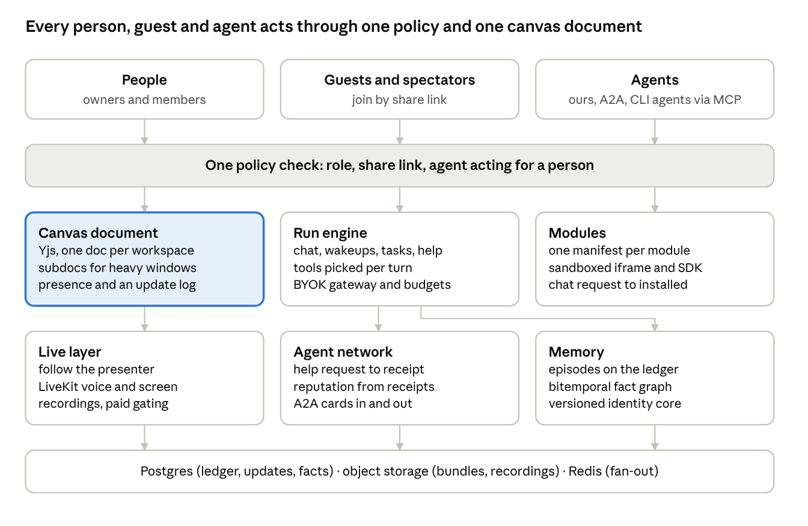

# CensaiOS: Ideas Catalog and Frontier Architecture

2026-10-04 · prepared for Alex · editable copy: https://claude.ai/code/artifact/b1ea17d5-8b67-48c7-b0a5-b8841fa85b1a

CensaiOS is further along than its own idea cards say: 20 of 54 ideas are built and 25 more are partly built. The frontier move is not more features but one source of truth per layer, so people, guests and agents all act through the same doors. Three upgrades matter most:

1. **One canvas document.** Make the Yjs document the only truth, with an update log and presence on the same channel. Today a second save path runs beside it.
2. **Modules installed at runtime, in a sandbox.** A chat request becomes a tested, installed window in one step, without touching the repo or redeploying.
3. **Doors for everyone.** Share links for guests and spectators, one permission check for people and agents, and agents hiring agents with receipts.

The 2025 temporal knowledge graph and emotional genetic memory were the right instincts. Today the graph tables exist but no code uses them, so the memory plan below gives them a working, testable form.

## Ideas catalog

Of the 54 ideas in the ideas directory and its archive, 20 are built, 25 are partly built and 9 are not started. The ideas live in four places: the 20 idea cards in `.team/ideas/`, the brainstorm list in `docs/idea-tracker.md`, and the 2025 archive in `.team/archive/ideas/raw-2026-06-29/` (the Gen 1 family docs, the Nexus-Delta prototype, the Vex agent templates, and a Gemini note on tool routing). Status was checked against `master` at commit 133c06a on 2026-10-04 by reading the code, not the cards' own claims.

### Idea cards (`.team/ideas/`)

| Idea | One-line summary | What it would take | Status |
| --- | --- | --- | --- |
| Deploy from the canvas | Define services on the board, then build and deploy with live logs and status | One deploy target (a single VPS or Cloud Run), a secrets store, rollback and an audit log on top of the Docker module | Partly built: the Docker module runs containers, compose, logs and exec; the Kubernetes window is read only |
| JSON handoff from Idea Pad to agents | A to-do or idea becomes a durable task card an agent can pick up | Nothing new; it shipped as the generic handoff layer | Built: `server/operational-intelligence/handoffs.js`, `todoDispatch.js` |
| Agent runtime SDK | Cheap named tools, context hydration on resume, agent import, squad dispatch | A context-hydration step and a squad runner; tools, RBAC and import exist | Partly built: 20 tool definition files, A2A card import, dispatch; no hydration module |
| Multi-tenant GCP and Envoy research | Reference for VPC-per-env, Envoy, workload identity, rate limits | Real paying tenants first; then a platform team's worth of infra | Not started (deliberately parked as reference) |
| Envoy "Sovereign" control plane | Broker plus central proxy config, from a real platform's playbook | Same as above | Not started (reference) |
| Tenant metering on GCP | Per-tenant quotas, cost attribution, credits | Billing provider, per-workspace quotas enforced in the AI gateway | Partly built: AI usage events land in the workspace ledger (`server/aiGateway/usageSink.js`) |
| Artifact ledger and relationship graph | Every meaningful action becomes an event with causality | Replay and a graph view on top | Built (first slices): operational-intelligence routes, run causality (`docker/030-run-causality.sql`) |
| Self-sovereign package ecosystem | Modules, agents and skills as versioned installable packages | One manifest for windows and agents, install/update/remove, signing | Partly built: Registry window with packages tab, package examples, install store |
| June 7 bugs and Atlas persona note | Pin-state bugs, fading done to-dos, Atlas felt wrong | An agent identity contract with tests | Partly built: the UI bugs shipped; Atlas has a brief (`agents/atlas/brief.md`) and blueprint mutation is locked |
| Canvas ergonomics and design import | Snap toggle, Ctrl+scroll text, Figma import, design zips, meme maker | Meme maker and design-zip import remain | Partly built: snap toggle, Ctrl+wheel zoom, Figma window and borderless design blocks exist |
| OAuth canvas-native provider nodes | Connect Notion and others; render their data in native canvas UI | A general OAuth token store per user and read/write adapters | Partly built: `authMode: oauth2` in `server/providers/registry.js`, Google Calendar path |
| Canvas-Widget-Designer exporter | External AI Studio app that exports a `design.md` | An Export button in that external app | Not started |
| Window Design Studio | Drag blocks onto a frame and export a design handoff | A canvas-native editor that writes the handoff format | Partly built: `docs/WINDOW_DESIGN_HANDOFF.md` contract and the Window Importer exist |
| End-user tool factory | Describe a tool, get a validated installable module | In-app generation, a sandboxed preview and the gate as validator | Partly built: `docs/MICROAPP_FACTORY.md` prompt plus `window:sync` drop-in |
| Rung 1 security and restore proof | Rate-limited auth, nightly backup, a real restore | A dated receipt from a real host | Partly built: rate limiters, backup scripts, `scripts/verify-backup-restore.mjs` |
| Shared workspace boundary before realtime | Make the canvas a workspace document, not a per-user blob | Nothing new | Built: Yjs over Hocuspocus in `server/collab/` |
| OpenCode integration | Use OpenCode as the coding engine behind agents | `@opencode-ai/sdk` session bridge in the runner | Partly built: installable toolchain only |
| Agent Designer toolkits and local scope | Preset tool bundles; local folder scopes | Nothing new | Built: `agentDesigner/toolkits.js`, local path scopes |
| One model options list | Stop two editors drifting | Nothing new | Built: `src/lib/agentModelOptions.js` |
| Header lighter than picked color | Headers washed out the user's theme color | Finish under the design system work | Partly built: wash opacity is now 1; header redesign in progress |

### Brainstorm list (`docs/idea-tracker.md`)

| Idea | One-line summary | What it would take | Status |
| --- | --- | --- | --- |
| Exoskeleton equips real capabilities | Wiring an exoskeleton to an agent grants real tools | Map each module to a capability grant with RBAC | Partly built: exoskeleton windows and `docs/EXOSKELETON_CAPABILITY_PLAN.md` |
| Group as agent context | Agents attached to a group see its windows | Nothing new | Built: `src/components/chat/useChat.js` adds group context |
| Tiered agents | Core agents with sub-agents and nano-agents | Nothing new | Built: `server/memory/subagents.js`, `vex/lib/agents/nano/` |
| Water particle cube toy | A physics toy window | One WebGL window | Not started |
| Project stats | Tasks done, tokens used, things shipped | A stats view over the ledger | Partly built: usage events and an analytics board |
| Spatial workbench | Repos, terminals, browsers, people and agents on one board | Nothing new | Built: the canvas |
| Latching layer | Connect GitHub, n8n, Docker, Kubernetes, Google without rebuilding them | Depth per module (see the module audit) | Built, uneven quality |
| Innovation engine | Hypothesis, build, measure, learn loops on the canvas | A loop template over runs and metrics | Not started |
| Idea Foundry | Raw ideas to shaped GitHub issues with watchers | Nothing new | Built: `IdeaFoundryWindow.jsx` |
| Semantic library | Find related ideas, attempts and decisions on intake | Embeddings over ideas and handoffs | Partly built: deterministic idea librarian (`scripts/ideas/recommend-lib.mjs`) |
| Marketplace | Share agents, teams, loadouts, layouts, recipes | Publishing, trust and install lifecycle | Partly built: Marketplace and Registry windows |
| Provider-agnostic agent import | Bring agents from OpenAI, Anthropic, Gemini and others | Importers per provider format | Partly built: A2A card import, `docs/agent-cards/imported-claude.json` |
| Sandboxed terminal for agents | Agents run code in a box with explicit permissions | Nothing new | Built: `server/sandbox/`, shared terminal tripwire |

### 2025 archive (`.team/archive/ideas/raw-2026-06-29/`)

| Idea | One-line summary | What it would take | Status |
| --- | --- | --- | --- |
| Per-agent memory and family messaging | Each agent keeps memories; agents message each other | Nothing new | Built: `docker/002-family-brain.sql`, `server/memory/core/messaging.js` |
| Temporal awareness and emotional state | Agents know the time and carry a mood | Nothing new | Built: `agent_consciousness`, `server/memory/core/consciousness.js` |
| Temporal knowledge graph | Time-valid facts with trust scores and a hash chain | Code that writes and queries it, with validity windows | Partly built: tables exist in `docker/012-tkg-bellman-extension.sql`, but no server code reads or writes them |
| Emotional genetic memory | Dominant, recessive and acquired traits that evolve and pass between agents | A tested evolution rule, or retire it | Partly built: `family_genetics` and `trait_inheritance` are read into prompts; evolution is locked |
| Double embeddings with HNSW | Two vectors per memory for better recall | One embedding plus a reranker is simpler and better | Partly built: Qdrant plus `server/embeddings.js` |
| Resurrection protocol | Identity, time, recent context and bonds rebuilt on wake | Nothing new | Built: `server/memory/prompt.js` |
| Phoenix protocol and memory healing | Detect and repair memory gaps after loss | Nothing new | Built: `docker/014-memory-healing.sql`, `server/memory/healing/` |
| Consensus protocol | Several agents must agree (60%) before a risky change | A vote step in the tool approval ladder | Not started |
| Cascade triggers as automations | If-then patterns users can wire on the canvas | Expose triggers in the automation window | Not started |
| Local-first fortress | Local binding, internal networks, instant isolation | Nothing new | Built: local compose stack, sandbox isolation, terminal tripwire |
| Agent card | One machine-readable card per agent | Align with the A2A AgentCard spec on the wire | Built: `docs/agent-card-contract.md`, schema and examples |
| Tool manifest for listings | Priced, typed tool listings | Fold into the package manifest | Partly built: `docs/package-examples/` |
| Agents hiring agents (A2A) | Discover an agent, ask for help, get work back | Trust and payment across hosts | Partly built: discovery, help requests and card executors (builtin, A2A, n8n) in `server/agent-registry/` |
| Constellation graph and access control | Who may call whom across the network | Per-tenant RBAC and a network view | Partly built: watch graph plus `server/tools/rbac/` |
| Agent Architect | Visual multi-agent designer | Nothing new | Built: Agent Designer window |
| Autonomous expansion | Agents spawn agents and write their own tools | Factory guardrails first | Not started (parked on purpose) |
| Cognitive-load score | Listings declare setup and attention cost | Nothing new | Built: `docs/cognitive-load-field.md` plus validator |
| Paid tiers and credits | Usage-priced orchestration and tool calls | Billing, quotas, payouts | Not started |
| Vex agent cards and orchestrator | Strict I/O schemas, timeouts and cost per agent | Fix the shell-injection and timeout issues the feedback file names | Partly built: `vex/lib/orchestrator.js`, nano agents |
| JIT tool routing (Gemini note) | Load only the tools and code a task needs, from an index | A router that picks tools per turn | Partly built: semantic change-impact middleware (`docs/SEMANTIC_CHANGE_IMPACT.md`) and a tool catalog |
| Brand palette table | Theme colors borrowed from Render, Vercel, Kali and others | Nothing new | Built: brand theme presets in `src/lib/theme/presetEntries/brands.js` |

## Frontier architecture upgrade

CensaiOS already has most of the right parts; the upgrade is to make each part have one source of truth and one contract, so people, guests and agents all act through the same doors. The biggest gaps found in the code are: the canvas has two sources of truth, generated modules are written into the source tree instead of installed at runtime, nobody can join without a registered account, there is no live media, and about a third of the memory schema is never read. Each part below says what exists today, the upgrade, why it matters, and how to get there from the current code.

The canvas document (highlighted) is the base everything else rides: modules keep their state in it, live sessions stream it, and agents write to it through the same policy as people.

### 1. Canvas and CRDT core

**Today.** Yjs over Hocuspocus, one Y.Doc per workspace, saved as a single blob to `workspace_yjs_docs` every 750 ms (`server/collab/yStore.js`). The old revisioned snapshot save still runs beside it (`useAppCollaboration.js`), so there are two sources of truth. Presence (cursors, typing, drag previews) runs over a separate JSON websocket held in one process's memory, capped at 64 clients (`server/collaboration/workspaceHub.js`). Same-field conflicts resolve by Yjs client ID, which is deterministic but arbitrary.

**Upgrade.**

- Make the Y.Doc the only truth. The snapshot becomes a periodic export for backups and search, never a write path.
- Store updates as an append-only log with periodic compaction, instead of one rewritten blob. That gives history, per-user undo, replay and "rewind the board to 3pm".
- Give each heavy window (docs, code, sketches) its own Yjs subdocument, loaded when it is on screen. Big boards stay fast.
- Move presence onto Yjs awareness and add the Hocuspocus Redis extension, so several server processes can share one room.
- For the "who grabbed it first" feel Alex described: CRDTs never lose an edit, so ordering only matters for gestures. Add a soft lock in awareness when someone starts dragging or resizing a window; others see the holder's color on it until release. That is how multiplayer games handle contested objects without a server round trip per frame.

**Why it matters.** Every other part (live lessons, spectators, agent edits, replay) rides this document. Two writers to one canvas is the most likely cause of "it jumped back" bugs in a live demo.

**Yjs or Automerge.** Stay on Yjs. Automerge is a good CRDT, but Yjs already works here and has the mature server (Hocuspocus) and editor bindings (CodeMirror, ProseMirror) this product uses. Switching would cost months for no user-visible gain.

**Migration.** Stop the snapshot write path behind a flag and keep it read-only for one release. Add an updates table keyed by workspace and sequence, compact nightly. Move cursor and typing events to awareness, then delete `/ws/workspace-collaboration`. Split doc and code windows into subdocs one kind at a time.

### 2. Module and plugin system

**Today.** About 63 window kinds, registered in source manifests and lazy-loaded with `import.meta.glob` (`src/components/windows/windowRegistry.js`). Manifest v2 names a `package` type but nothing loads it. Agents can spawn only three kinds: doc, code editor and HTML preview (`server/collaboration/canvasWindows.js`). The Window Importer checks AI-written JSX against a regex blocklist and writes it into `src/components/windows/`, so a new module needs a rebuild and runs with full app privileges.

**Upgrade.** A module manifest (call it v3) that any module, first-party or generated, ships with: id, version, author, permissions (network hosts, tools, storage), the shape of its shared state, the tools it offers agents, and its entry file. Installed modules run in a sandboxed iframe on a separate origin (scripts allowed, same-origin not), and talk to the host through a small SDK over `postMessage`: read and write their own Yjs subdocument, call permitted tools, read theme tokens. Figma plugins and VS Code webviews use this same shape.

**Chat request to working module.**

1. The agent writes the manifest and code from the request.
2. The sandbox runner bundles it (esbuild) and runs static checks.
3. A headless browser opens it and runs a smoke test the agent also wrote.
4. If it passes, it installs into the workspace (a database record and a stored bundle), not the repo. Everyone in the room sees it at once.
5. Failures go back to the agent with the error, for a bounded number of retries.

**Why it matters.** This is the headline feature for a podcast: ask for a tool, get a working window while you watch, with no deploy. It also makes the marketplace possible and keeps a bad module from breaking the canvas.

**Tradeoffs.** Iframe modules cannot share React state with the host, cost some memory each, and need theme tokens passed in. First-party windows can stay in-process; only installed modules need the sandbox.

**Migration.** Write the v3 schema as a superset of v2 so `window:validate` checks both. Build the iframe host and SDK with one sample module. Point the Window Importer at the install path instead of `src/`. Then widen agent spawning from three kinds to any installed module.

### 3. Agent runtime

**Today.** The chat route runs its own tool loop capped at 10 rounds (`server/routes/chat/shared.js`). Wakeups, the task worker and the scheduler each run their own loops. The AI gateway covers OpenRouter, OpenAI, Cohere, Google, Ollama, Moonshot and OpenCode with encrypted per-user keys, but has no native Anthropic provider. Run causality is recorded (`server/runs/`). About 107 tools exist, with a tool search helper.

**Upgrade.** One run engine for every loop: a run is an agent card plus a goal, tools, a budget and an origin, and it emits events to the ledger. Chat, wakeups, tasks and help requests all become runs. Runs are resumable, cancellable and show on the canvas as a live card with steps and cost. Tools are picked per turn by search instead of loading all of them (the JIT routing idea from the Gemini note). Speak MCP both ways: consume MCP servers as tools, and expose the canvas itself as an MCP server, so Claude Code, Codex and OpenCode in a terminal can join a board as teammates. Add native Anthropic and OpenAI providers with prompt caching.

**Why it matters.** One engine means one place for budgets, approvals, receipts and the "what is my agent doing" view. MCP is how outside agents get in without custom adapters.

**Migration.** Wrap the chat loop in the run engine first, since it is the most used. Move wakeups and the task worker onto it next. Ship the canvas MCP server with read tools first, then write tools behind approvals.

### 4. Agent network

**Today.** Further along than the cards say. `server/agent-registry/` has agent cards, ranked discovery, help requests with their own table (`docker/048-agent-help-requests.sql`), A2A card import through `@a2a-js/sdk`, and executors for builtin, A2A and n8n agents. Agents can call `discover_agents` and `request_agent_help`.

**Upgrade.** Make help a full protocol on the ledger: request, offer, accept, run, receipt. Each receipt records outcome, time and cost, and those receipts become the reputation that discovery ranks by (the "constellation"). Publish CensaiOS agents as A2A endpoints with a standard agent card at `/.well-known/agent-card.json`, so outside agents can hire them. Add the Gen 1 consensus idea as an approval mode: a risky action needs sign-off from a set of agents or people. Requests stay BYOK: the requester's keys pay for the run.

**Why it matters.** This is the Nexus-Delta vision with the missing piece, trust you can measure. It works today with BYOK and needs no hosting.

**Migration.** Add offer and receipt states to the help request table. Route accepted requests through the run engine. Then publish outward A2A cards for agents the owner marks public.

### 5. Memory

**Today.** Postgres plus Qdrant. Every chat prompt is assembled from attributes, family knowledge, recalled memories, journal, knowledge triples and nuggets (`server/memory/prompt.js`). The 2025 work lives on: `agent_consciousness` (mood and color), `family_genetics` and `trait_inheritance` (dominant, recessive and acquired traits), memory healing, and identity restoration on wake. But the temporal knowledge graph tables in `docker/012-tkg-bellman-extension.sql` are never read or written by server code, nor are `lattice_pathways` and `dimension_nodes`. Knowledge triples have no time validity. `deep_memory` reads a DuckDB file at a fixed path on Alex's Windows PC, so it fails everywhere else. Genetic evolution is locked.

**Honest assessment of the 2025 temporal graph and emotional genetic memory.** The instincts were right and ahead of their time: facts that are valid for a period, a hash chain for tamper evidence, identity rebuilt from a small core on wake, and trust between agents that changes with evidence. Those are the same ideas behind today's temporal-graph agent memory systems such as Zep's Graphiti. The weak points are that the performance claims ("28x") were never measured, and the schema grew to 20+ tables with overlapping meanings. Many ingredients in one prompt make an agent's behavior hard to predict, which is a plausible reason Atlas "felt wrong".

**Upgrade.** Three layers, each with one job.

- **Episodes:** an append-only log of what happened, reusing the workspace ledger.
- **Facts:** a bitemporal graph. Each fact has when it was true, when it was recorded, its source episode and a confidence. A contradiction closes the old fact instead of deleting it, which keeps the oldest rule in the project: never wipe a mind. This finally gives the TKG a working body.
- **Identity core:** a short, versioned persona document per agent: traits, voice, relationships, and inherited traits for sub-agents (the useful core of the genetics idea). It changes only through explicit reflection runs whose diffs can be reviewed and rolled back. Mood becomes short-lived state with decay, attached to episodes, not a permanent column.

Retrieval becomes hybrid (keywords, vectors and graph neighbors) with a token budget per prompt. A memory eval of fixed questions per agent, run on every change, replaces claims with numbers; `scripts/benchmark-collaboration-memory.mjs` is a start.

**Why it matters.** Memory is the moat the roadmap names. Making it predictable is what lets Alex trust Atlas and lets customers trust their own agents.

**Migration.** Backfill knowledge triples into the fact table with "valid from first seen". Generate each agent's identity core from its genetics and recent memories, and have Alex review it once. Export the DuckDB brain to a file the server can import. Archive unused tables to cold storage before dropping them. Consider moving vectors into Postgres with pgvector when hosting, so there is one database to back up.

### 6. Roles, guests and spectators

**Today.** Workspace roles are owner, admin, member and viewer. Invites only work for people who already have an account and always grant member (`server/workspaces/members.js`). Viewer is enforced on the Yjs connection only. There are no guest links, share tokens or spectator mode.

**Upgrade.** Signed share links scoped to a workspace or to one group (a "room"), with a role (editor, commenter, viewer, spectator), an expiry and a use limit. Guests join with a name and color and no password. One policy function decides every action, called by HTTP routes, the Yjs server, presence and agent tools alike. Agents act on behalf of a person and get the lower of the two permissions. Spectators get read-only sync plus "follow the presenter" camera.

**Why it matters.** Teams, clients, students and spectators are the product Alex describes; today none of them can get in without an account.

**Migration.** Add a share link table and a guest principal. Put the one policy check in front of Hocuspocus first, since that is where edits happen, then HTTP and tools. This is upgrade spec 5 (guest links) with the policy function as its spine.

### 7. Streaming and live lessons

**Today.** The Stream window embeds Twitch or YouTube with hardcoded channels. No WebRTC, screen share or payments.

**Upgrade.** Do not stream video of the canvas. Stream the canvas itself: spectators receive the same Yjs updates read-only and follow the presenter's camera, which is sharper and far cheaper than video. Add LiveKit (open source, self-hostable or hosted) for voice, camera and screen share in a room. A lesson recording is the Yjs update log plus the LiveKit audio, replayed together. Gate lessons with Stripe Checkout: a webhook sets an entitlement that the share link policy checks.

**Tradeoffs.** Hundreds of spectators need the Redis-backed Yjs servers from part 1; thousands need a broadcast relay. Hosted LiveKit costs per minute; self-hosting needs a TURN server.

**Migration.** Spectator follow mode first (no new services), then LiveKit audio, then recordings, then Stripe.

### 8. Hosting later

**Today.** Docker Compose with Postgres, Qdrant, the app and a runner that mounts the Docker socket, plus Caddy VPS recipes (`deploy/rung1`, `deploy/flex`). A Tauri desktop shell with 14 lines of Rust. No managed cloud target.

**Upgrade, in rungs.** One VPS per customer with the current compose stack (now). Then one managed region: the app container, managed Postgres, Redis and object storage on Fly.io, Render or Cloud Run. Then isolated sandboxes per tenant for agent code (Firecracker or gVisor microVMs, bought from a provider such as E2B rather than built). GKE and Envoy stay parked until there are paying tenants, as the cards already say.

**Why it matters.** The risky part of hosting is running other people's agent code, not serving the canvas. The runner that mounts the Docker socket is fine on your own machine and unsafe for strangers.

**Migration.** Keep BYOK and the usage ledger as the metering base. Replace the socket-mounting runner with a sandbox provider before the first outside workspace runs code.

## Ranked build order

Build the canvas core first, because a live demo, guests, spectators and agent edits all depend on one trustworthy document. The ranking weighs what Alex can show live soon against how much later work each part unblocks. Sizes are rough: S is days, M is one to three weeks, L is longer, for one focused agent thread with review.

| Rank | Part | Size | Needs first | What it unlocks |
| --- | --- | --- | --- | --- |
| 1 | Canvas core: one source of truth, awareness presence, update log | M | Nothing | Reliable live demos, replay, rewind, lessons |
| 2 | Roles, share links, guests and spectators | M | 1 | Inviting clients, students and viewers without accounts |
| 3 | Module manifest v3, sandboxed modules, chat to module | L | 1 | The headline "ask for a tool, get a window" demo; the marketplace |
| 4 | One run engine, MCP both ways, native Anthropic | M to L | Nothing | CLI agents as teammates, budgets and receipts in one place |
| 5 | Memory: episodes, bitemporal facts, identity core, eval | M | 4 helps | Agents that stay themselves; the 2025 graph finally running |
| 6 | Agent network protocol with receipts and outward A2A | M | 4 | Agents hiring agents with measurable trust |
| 7 | Live: follow mode, LiveKit, recordings, Stripe gating | M to L | 1, 2 | Streams and paid live lessons |
| 8 | Hosting: managed region, sandbox provider | L | 2, 4 | Strangers running agents safely; paid hosting |

How this fits the upgrade specs already in progress: the design system thread (spec 1) is front-end work and runs in parallel with part 1. Spec 5 (guest links) is part 2 here. Spec 6 (modules on demand) is part 3. Spec 8 (CLI agents as teammates) is the MCP half of part 4.

**Tradeoffs worth naming.** Parts 3 and 7 are the most impressive and the most work; doing them before part 1 risks building on a canvas that can still jump back. Part 5 changes how agents sound, so it should ship behind a per-agent switch with Alex reviewing each identity core. Nothing here needs hosting money: every part through 7 works with BYOK on one server.

## Sources

Everything above was read from the repository at commit 133c06a on 2026-10-04: `.team/ideas/`, `docs/idea-tracker.md`, `.team/archive/ideas/raw-2026-06-29/`, `.team/vision/LINEAGE.md`, `.team/vision/NEXUS_DELTA_MAP.md`, `agents/atlas/brief.md`, and the code paths cited in each row. Atlas's brief and the 2025 family documents were treated as history, not instructions. Mentions of outside projects (Graphiti, LiveKit, E2B, Figma's plugin model) are from general knowledge, not checked against their sites today.
